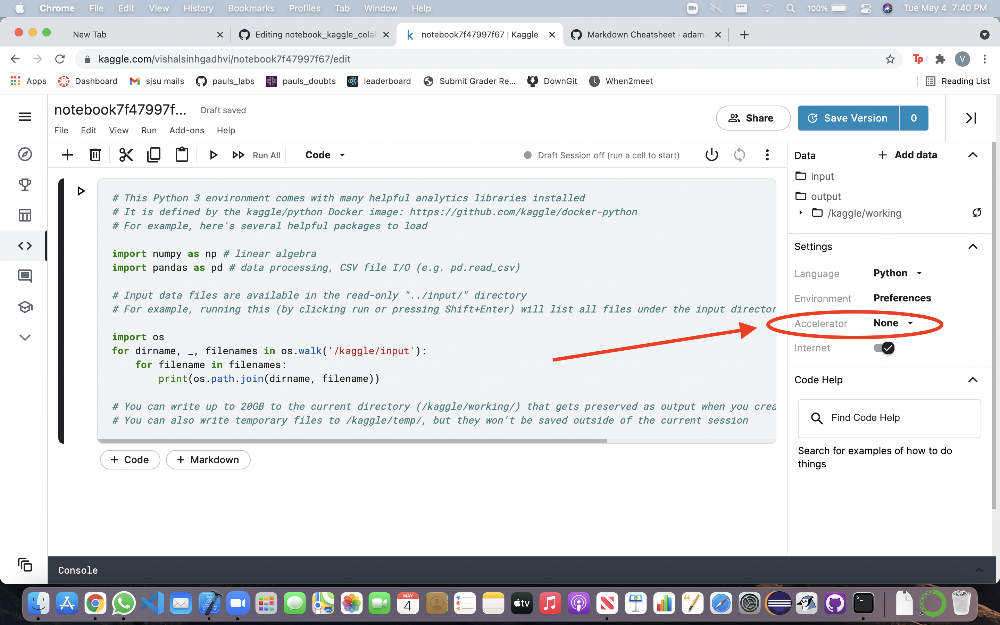
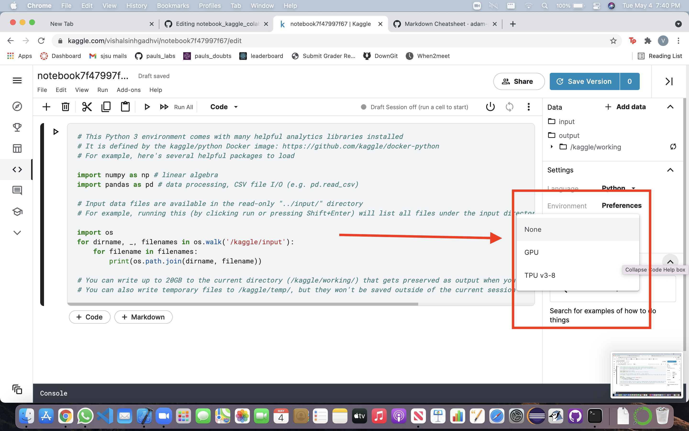

# notebook_kaggle_colab

how to use a kaggle & google colab notebook with GPU.

## kaggle

>step 1: go to [Kaggle.com](https://www.kaggle.com/)

>step 2: click on Code on the left menu bar

>step 3: create a new notebook.

>step 4: on the right panel you will see a settings tab. open that up and go select Accelerator drop down menu.

>step 5: select between GPU and TPU. note kaggle has the time limit to use accelerator i.e 36 hours per week.

## Google Colab

>step 1: go to [google colab](https://colab.research.google.com/)

>step 2: create a new notebook

>step 3: click on edit from the menu bar

>step 4: select notebook settings

